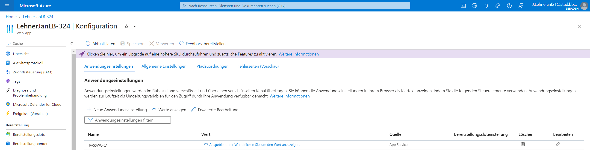

# LB 324

## Aufgabe 2
Erklären Sie hier, wie man `pre-commit` installiert.

## Pre-commit installieren ##

Um "pre-commit" zu installieren, gibt es zwei mögliche Wege. 

#### ! Wichtig, um pre-commit installieren zu können, benötigen Sie Pip. Unter folgender URL finden Sie ein Tutorial zur Installation: ####
https://pip.pypa.io/en/stable/installation/ 

#### Variante 1
Öffnen Sie Visual Studio Code, anschliessend erstellen Sie ein neues Terminal  und geben dort folgenden Befehl ein:

`pip install -r requirements.txt`

#### Variante 2
- Öffnen Sie die Konsole (Windows-Taste --> cmd --> Enter)
- Navigieren Sie ins Projekt (`cd HierDerPfadZumProjekt`)
- Requirements installieren (`pip install -r requirements.txt`)

## Aufgabe 4
Erklären Sie hier, wie Sie das Passwort aus Ihrer lokalen `.env` auf Azure übertragen.
  
#### Die ausgelieferte Software ist unter folgendem Link erreichbar: 
https://lehnerjanlb-324.azurewebsites.net/ 

Um das Passwort auf Azure zu übertragen, habe ich zuerst eine neue Web-App erstellt.   
Als diese fertig war, klickte ich darauf.

In der Web-App klickte ich unter `Einstellungen` auf `Konfiguration`.  
Es öffnet sich ein neues Fenster, in dem ich eine neue Anwendungseinstellung, durch Klicken auf `Neue Anwendungseinstellung`, hinzufügen konnte.
  
Als Name dieser Einstellung wählte ich `PASSWORD` und der Wert ist das Passwort. 
  
In folgender Abbildung sehen Sie das Fenster mit den Einstellungen:

## Weitere Informationen
#### Übernahmen von Python Code  
Da ich nicht verstanden habe, wie man den Code für das gewünschte Feature anpassen muss, habe ich, mit Einverständnis von ihm, den Code von Jan Vontobel übernommen. Bei den übernommenen Änderungen handelt es sich um nicht bewertete Teile. 